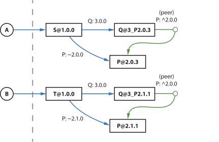

# lockfile-explorer-demos

   
  
  

This branch is part of
[a tutorial series](https://lfx.rushstack.io/pages/scenarios/demos_repo/)
from the **Lockfile Explorer** documentation.

👉 To report problems with this content, [create a GitHub issue](https://github.com/microsoft/rushstack-websites/issues) in the main [microsoft/rushstack-websites](https://github.com/microsoft/rushstack-websites/issues) monorepo.

## This branch: demo/doppel-1

  

## Instructions

This is a [Rush](https://rushjs.io) monorepo that uses the [PNPM](https://pnpm.io/) package manager.
Because it relies on locally published NPM packages:

👉 You must launch the Verdaccio service before installing; otherwise `rush install` will report `ECONNREFUSED` errors.

Please see the Lockfile Explorer
[Demos repository](https://lfx.rushstack.io/pages/scenarios/demos_repo/)
documentation for complete setup instructions, as well as explanations of each demo branch.

## Contributor Notice

This repo welcomes contributions and suggestions.  Most contributions require you to agree to a
Contributor License Agreement (CLA) declaring that you have the right to, and actually do, grant us
the rights to use your contribution. For details, visit https://cla.microsoft.com.

When you submit a pull request, a CLA-bot will automatically determine whether you need to provide
a CLA and decorate the PR appropriately (e.g., label, comment). Simply follow the instructions
provided by the bot. You will only need to do this once across all repos using our CLA.

This repo has adopted the [Microsoft Open Source Code of Conduct](https://opensource.microsoft.com/codeofconduct/).
For more information see the [Code of Conduct FAQ](https://opensource.microsoft.com/codeofconduct/faq/) or
contact [opencode@microsoft.com](mailto:opencode@microsoft.com) with any additional questions or comments.

